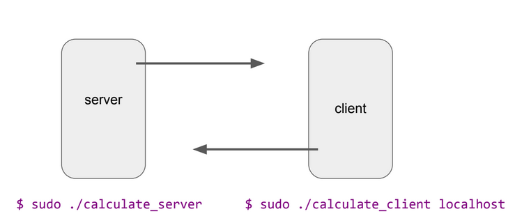

# Remote Procedure Call (RPC) Application
---
## How RPC Works
- **Step 1 :** Specify the protocol for client server communication.
An **interface description language (IDL)** to let various platforms call the RPC. The IDL files can then be used to generate code to interface between the client and servers. So, in IDL file, we define the program structure like below. Save this IDL file with **.x** extension.
A remote procedure is uniquely identified by the triple: (**program number, version number, procedure number**). Therefore, you need to give any numbers you like to the program, to the version and to the procedures as in the above sample IDL file.
```c
// calculate.x --> file name
struct inputs{
    float num1;
    float num2;
    char operator;
};
program CALCULATE_PROG{
    version CALCULATE_VER{
        float ADD(inputs)=1;
        float SUB(inputs)=2;
        float MUL(inputs)=3;
        float DIV(inputs)=4;
    }=1;
}=0x2fffffff;
```
Then compile IDL file using **rpcgen** protocol compiler. The protocol compiler reads the definition of the IDL file and automatically generates client and server **stubs**. First you need to check whether the **rpcbind** has been installed in your machine. Type this command to check it and if the execution of the command gives you a long list as below in the image, then you machine has already installed rpcbind package and you can work on with the **rpc** commands.
```bash
$ sudo apt-get update
$ rpcinfo
$ sudo apt-get install rpcbind
$ sudo apt install libc-dev-bin
$ sudo apt install libntirpc-dev
$ sudo apt install gcc
$ rpcgen -a -C calculate.x
```
&emsp;● **calculate_client.c** —-> client program (editable file)\
&emsp;● **calculate_server.c** —> server program (editable file)\
&emsp;● **calculate_cln.c** —> client stub\
&emsp;● **calculate_svc.c** —> server stub\
&emsp;● **calculate_xdr.c** —> XDR (External Data Representation) filters\
&emsp;● **calculate.h** —> header file needed for any XDR filters\
&emsp;● **Makefile.calculate** —> compile all the source files by using this file

- **Step 2 :** Develop the client program
Edited the code in the **calculate_client.c** file like the way it accepts the client’s inputs from the keyboard and outputs the remote procedures (**add,sub,mul,div**) invoking results to the client.
```c
#include "calculate.h"

float calculate_prog_1(char *host,float n1,float n2,char opr,CLIENT *clnt) {
    float *result_1;
    inputs add_1_arg;
    float *result_2;
    inputs sub_1_arg;
    float *result_3;
    inputs mul_1_arg;
    float *result_4;
    inputs div_1_arg;
    ...
```

- **Step 3 :** Develop the server program
Similarly, edit the **calculate_server.c** file while adding your own codes for the previously defined remote methods(**add,sub,mul,div**).
```c
#include "calculate.h"

float * add_1_svc(inputs *argp, struct svc_req *rqstp) {
    static float result;
    result = argp->num1+argp->num2;
    printf("Got Request : Adding %f and
    %f\n",argp->num1,argp->num2);
    printf("Sent Response : %f\n",result);
    return &result;
}
...
```

- **Step 4 :** Compile
```bash
$ sudo apt install make
$ make -f Makefile.calculate
```
## Depiction
